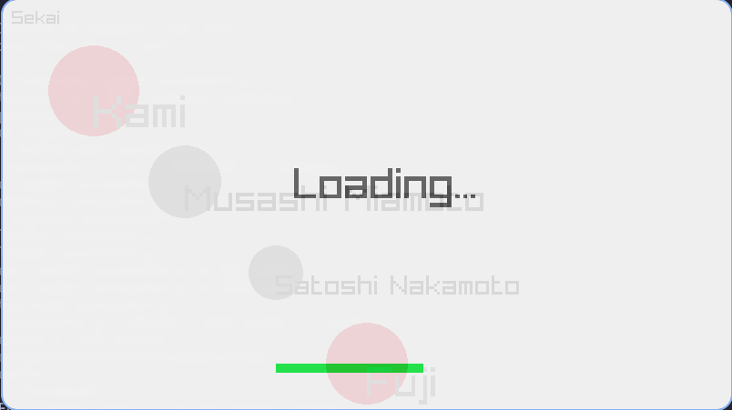
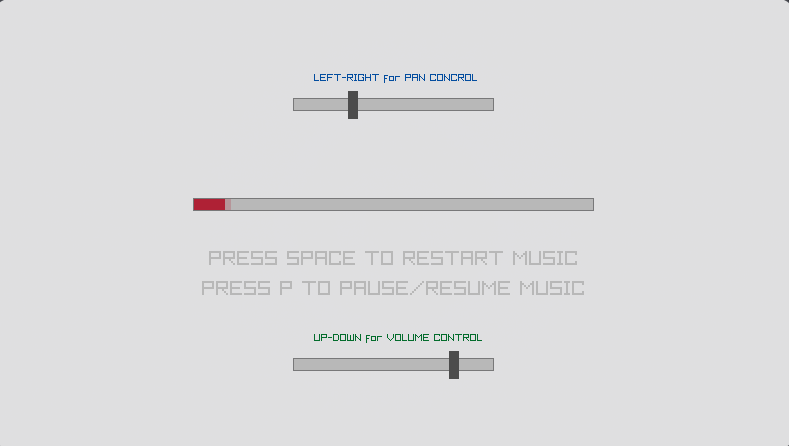
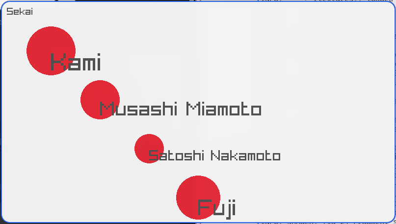

# sekai

```bash 
git clone http://github.com/Goitseone-Themba/sekai.git
cd sekai
gcc main.c -o sekai $(pkg-config --libs --cflags raylib)
./sekai

```

Base {
  - posX
  - posY
  - radius
}

Entity {
- vital_status
- lifeSpan
}

Artifact {

}

Event {

}

UniversalSet {
- < Cardinality of each set in the world >
}




